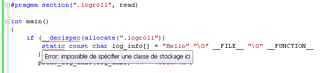

# Logroller

## Présentation

Logroller est une bibliothèque de génération de logs conçue et pleinement optimisée pour le langage C++. Loin de l'approche «usine à gaz», elle se veut d'une utilisation simple et flexible tout en étant techniquement très pointue (ses performances sont incomparables avec la plupart des alternatives).

## Utilisation

Les logs générés par logroller ne sont pas destinés à être consultés par les utilisateurs finaux d'une application, mais par ses développeurs. Typiquement, il s'agit d'enquêter sur un problème rencontré lors d'une exécution chez un utilisateur. Mais il peut aussi s'agir de constituer des statistiques.

Logroller n'impose pas de cadre d'utilisation rigide et se veut extensible. L'idée est de s'adapter aux contraintes des programmeurs plutôt que l'inverse. En particulier, une certaine syntaxe d'utilisation est proposée sans être imposée. Des éléments sont fournis pour être créatif à ce niveau afin que chacun puisse définir une syntaxe qui lui plait et qui l'encourage à placer de nombreux messages de log dans son code.

Logroller aspire à devenir un véritable compagnon de qualité logiciel pour tout programmeur C++. En plus de l'enregistrement de messages de logs, elle permet de collecter des informations utiles au débogage et à l'optimisation, à la mesure de performance, à la recherche de fuites mémoires, à l'établissement de statistiques (couverture du code, zones chaudes, ...), à la vérification des invariants, ... Il ne tient qu'à vous d'allonger cette liste !

## Exemple

```cpp
#define LOGROLLER_ALLOW_LITERAL_STRING_AS_ARG
#include "logroller.h"

int main(int argc, char **argv)
{
    if (!log_init(argc, argv, inprocess_reader( text_printer(
            console_writer() + file_writer("%appname%.log") ) )
        return 0;

    if (!log_init(argc, argv, to_textfile("%appname%.log"))
        return 0;

    log_info("Hello World!");
       
    log_info("Syntaxe") << "à" << "la" << "istream";
    log_info("Syntaxe à la %1 (%2)").arg("Qt").arg("QString::arg");      
    log_info("Syntaxe") % "à" % "la" % "Qt (operateur %)";
    log_info("Syntaxe mixte %1 %2/%1 %3/%4").arg("Qt") % "arg" << "%" << "istream";
}
```

```
* --- Program general info ---
* Date:                 15/sept/2012 15:54:41
* Program:              D:\logroller\test\Debug\test.exe
* Command line:         ""
* Run as administrator: No
* From a network drive: No
* Abnormal terminaison: No 
* 
* --- System info ---
* OS:                   Windows XP SP3 32 bits
* CPU:                  Intel(R) Celeron(R) CPU 530 @ 1.73GHz
* MHz:                  1733 
* Physical RAM:         768 Mo
* 
* --- Global CPU stats ---
* Total execution time: 200 ms
* Kernel time:           10 ms
* User time:            190 ms
* Logging time overhead: 10 ms
* 
* --- Global memory stats ---
* Heap size on exit:     454 Ko
* Max working set size:  600 Ko
* Available RAM on exit: 385 Mo
* 
* --- Global logs stats ---
* Logged messages:       4
* Size of message data:  52
* Nb threads logged:     1
* Nb source files:       1
* Nb functions:          1
* 
* --- Begining of logs ---
15:54:41:100  #1  [test.cpp:8]   main()  {info}   Hello World!
              #1  [test.cpp:10]  main()  {info}   Syntaxe à la istream
--:--:--:110  #1  [test.cpp:11]  main()  {info}   Syntaxe à la Qt (QString::arg)
              #1  [test.cpp:12]  main()  {info}   Syntaxe à la Qt (operateur %)
--:--:--:120  #1  [test.cpp:13]  main()  {info}   Syntaxe mixte Qt arg/Qt %/istream
              #1  [test.cpp:15]  main()  {trace}  return 0
* --- End of logs ---
* 
* --- Detailed logs stats ---
* <function name>              <nb called>   <duration>                 <log overhead> <mem allocs>        
* test.cpp:main                    1          200 ms (real: <200 ms)          0
```

```
main() [D:\logroller\test\main.cpp]
| 5: Hello World!
| 8: Program name: test.exe
|12: Parameter 1 = 'param1'
+12: Parameter 2 = 'param2'

D:\logroller\test\main.cpp
  [main]  5: Hello World!
          8: Program name: test.exe
         12: Parameter 1 = 'param1'
             Parameter 2 = 'param2'
             Parameter 3 = 'param3'
  [f]    24: Hello!


main.cpp [main]   Hello World!
         [main]   Program name: test.exe
         [main]   Parameter 1 = 'param1'
         [main]   Parameter 2 = 'param2'
         [main]   Parameter 3 = 'param3'
         [f]      Ok!
f.cpp    [f]      Hello!
         [main]   Terminé!


main.cpp     main()      5:    Hello World!
-            -           8:    Program name: test.exe
-            -          12:    Parameter 1 = 'param1'
-            -           -     Parameter 2 = 'param2'
-            -           -     Parameter 3 = 'param3'
-            f()        24:    Ok!
f.cpp        f()        11:    Hello!
main.cpp     main()     18:    Terminé!


main.cpp [main|   Hello World!
         |main|   Program name: test.exe
         |main|   Parameter 1 = 'param1'
         |main|   Parameter 2 = 'param2'
         |main|   Parameter 3 = 'param3'
         [f]      Ok!
f.cpp    [f|      Hello!
         [f]      Ok!
         |f]      Ok!
main.cpp |main]   Terminé!
```

### reader, printer et writer

Comme évoqué en introduction, logroller se limite à enregistrer des messages dans un buffer circulaire qui tourne («roll») constament. Et elle ne fait vraiment rien de plus.

La récupération, la mise en forme et l'affichage de ces messages sont effectués par d'autres composants logiciels. Comme il s'agit de 3 opérations différentes, ces composants sont naturellement scindés en 3 groupes :

* Les readers : s'occupent de récupérer les messages enregistrés par logroller pour les transmettre aux printers.
* Les printers : s'occupent de la mise en forme des messages récupérés (au format texte ou html par exemple).
* Les writers : s'occupent d'écrire le résultat quelque part (typiquement dans un fichier ou une console).

Ces 3 composants se combinent les uns aux autres pour constituer un pipeline de traitement des messages de logs, suivant l'ordre reader -> printer -> writer. L'exemple des fonctions utilitaires `to_console()`,
`to_textfile()` et `to_htmlfile()` illustrent leur principe d'utilisation :

```cpp
log_reader_ptr to_console()
{
    return inprocess_reader(
               text_printer(
                   console_writer() ) );
}

log_reader_ptr to_textfile(const char * filename_format = "%appname%.log")
{
    return inprocess_reader(
               text_printer(
                   file_writer(filename_format) ) );
}

log_reader_ptr to_htmlfile(const char * filename_format = "%appname%.html")
{
    return inprocess_reader(
               html_printer(
                   file_writer(filename_format) ) );
}
```

Les éléments mis en jeux sont les suivants :


* inprocess_reader : s'occupe de récupérer les messages de logs depuis un thread spécifique au sein même de l'application. Ce thread s'occupe aussi d'héberger l'exécution du/des printer(s) ainsi que de leur(s) writer(s) respectif(s).
* text_printer : met en forme les messages de logs sous forme texte.
* html_printer : met en forme les messages de logs au format html.
* console_writer : affiche les messages formatés dans la console du programme hôte (ou en crée une à défaut).
* file_writer : sauvegarde les messages formatés dans un fichier local.

Ces éléments ne font pas partie du coeur de logroller, mais de sa périphérie. De cette manière, chacun est libre de choisir ou de créer la combinaison qui lui plaît sans avoir à incorporer le code d'élements qui ne l'intéressent pas. En effet, l'utilisation de chaque élément implique de lier le programme final à la bibliothèque dans laquelle il est défini.

### Fonctions d'initialisation

Il existe une quatrième catégorie de fonctions : les fonctions d'initialisation. Ces fonctions sont déclinées en autant de types d'applications à supporter :

* `log_init()` : à appeler depuis le programme principal, aussi bien depuis la fonction `main()` standard que depuis le `WinMain()` des applications Windows. En fonction du contexte d'utilisation, `log_init()` peut renvoyer `false`. Dans ce cas l'application doit immédiatement se terminer sans erreur particulière car il s'agit d'un comportement normal destiné à étendre l'utilisation du programme hôte : exécution en tant qu'enfant de lui-même (génération «outofprocess» des logs), mise en forme de logs binaires reçus en lige de commande, etc.
* `log_init_dll()` : à appeler depuis le point d'entrée d'une bibliothèque dynamique. De cette manière, une dll est capable de logger ses messages dans le même buffer que son application hôte si celle-ci utilise aussi logroller (idéal pour une sortie console ou fichier commune). Mais elle peut aussi bien sûr utiliser son propre canal dédié (fichier séparé).

## Apperçu des spécificités

Logroller se distingue de la plupart des bibliothèques existantes en de nombreux points. Aussi il est recommandé de d'abord lire ce qui suit avant de commencer à l'utiliser.

Au niveau technique :

* logroller ne recopie pas les messages textes mais enregistre seulement leur emplacement mémoire. L'absence de recopie du contenu des messages permet de réduire considérablement leur coût d'enregistrement (tant en espace qu'en temps). Pour plus de détails, voir **Pas de recopie du message texte principal**.
* Les logs générés sont dans un format binaire extrêmement compact, ce qui limite l'impact de leur génération sur le logiciel hôte et diminue considérablement l'espace mémoire nécessaire à leur stockage. Cela permet aussi de restreindre - si nécessaire - leur consultation aux seuls développeurs de l'application (afin par exemple de ne pas exposer publiquement son fonctionnement interne).
* En conséquences, une étape supplémentaire est requise pour pouvoir consulter les logs générés. C'est lors de cette étape que sont effectuées les opérations de mise en forme et de filtrage du contenu. En se déchargeant de ces étapes au moment de l'enregistrement, la complexité globale est réduite. L'empreinte mémoire et CPU aussi.

Le coeur de la bibliothèque ne s'occupe donc finalement que d'une seule chose : la collecte et l'enregistrement de messages.

Il en résulte la philosophie d'utilisation suivante :

* Tous les messages disponibles sont systématiquement enregistrés. Logroller considère que leur filtrage n'est pas de sa responsabilité mais est celle du logiciel de visualisation des logs. Typiquement, un développeur souhaite obtenir le plus d'information possible sur certaines parties précises du code, et ignorer tout le reste. Ceci peut se faire facilement au moment de la visualisation, alors qu'il est très difficile d'anticiper les lignes de logs qui seront véritablement utiles utérieurement.

* Il n'y a donc pas d'intérêt à classer les messages en niveaux hiérarchiques du type TRACE < DEBUG < INFO < WARNING < ERROR < FATAL. D'autant plus que l'usage montre qu'une telle classification n'est pas évidente à déterminer pour chaque message : c'est souvent le contexte de sa consultation qui définit son intérêt, plus que son importance supposée au moment de l'écriture du code. Logroller permet toutefois d'associer librement des catégories aux messages, mais ces catégories n'ont pas de relation hiérarchique entre elles : il s'agit plutôt de tags.

* Logroller structure et hiérarchise les messages suivant le fil d'exécution du programme. Parce qu'elle est capable d'enregistrer la durée de vie du bloc dans lequel se trouve chaque message, elle permet de reconstituer leur imbrication respective, et donc de distinguer les messages émis par une fonction donnée de ceux issus des sous-fonctions appellées. Les messages sont alors organisables sous une forme arborescente qui reproduit fidèlement la pile d'appels du programme.
 
* Le formattage, l'organisation et le filtrage des messages sont effectués à la lecture du fichier de logs. C'est à ce moment que le développeur décide ce qu'il souhaite voir ou au contraire ignorer, grâce tout d'abord à la hiérarchie des appels de fonctions, mais aussi à d'autres critères tels que l'emplacement du message dans le code source (nom du fichier, nom de la classe, nom de la fonction, numéro de ligne), au tag associé, au thread émetteur, etc.

### LOGROLLER_ALLOW_LITERAL_STRING_AS_ARG

Par défaut, logroller ne permet pas de passer des chaînes litérales en arguments comme dans l'exemple suivant: 

```cpp
void f(int a, int b)
{
    log_info("Paramètres: a=") << a << " b=" << b;
}
```

Si la constante `LOGROLLER_ALLOW_LITERAL_STRING_AS_ARG` n'est pas explicitement définie, le code ci-dessus ne compilera pas à cause de la chaîne `" b="` qui se trouve dans la liste des arguments.

Logroller incite en effet à réécrire un tel code de cette façon :

```cpp
void f(int a, int b)
{
    log_info("Paramètres: a=%1 b=%2") << a << b;
}
```

Comme on peut le voir, le même résultat est obtenu avec moins d'instructions ce qui rend l'opération moins coûteuse mais aussi plus lisible.

Ce comportement par défaut (modifiable en définissant la constante `LOGROLLER_ALLOW_LITERAL_STRING_AS_ARG`) s'inscrit dans la continuité de la non recopie du message texte principal.
 
## Implémentation en C++

### Pas de recopie du message texte principal

Partant du constat que la plupart des messages de logs sont constitués d'un message texte «en dur», et que la recopie de ce message est de loin l'opération la plus coûteuse, logroller se contente d'enregistrer l'adresse de cette chaîne litérale plutôt que son contenu. Les principes techniques et la fiabilité de cette approche sont détaillés dans les paragraphes qui suivent.

En C/C++, les chaînes littérales sont incorporées dans le code binaire du programme compilé dans une zone mémoire spécifique de l'exécutable final (en général ils s'agit de la section .rdata). C'est aussi le cas des bibilothèques dynamiques (.dll, .so). Au sein de cet exécutable, leur emplacement est figé et ne change pas. Il est donc assez facile, à partir d'une adresse mémoire donnée, de retrouver la chaîne littérale associée à la seule condition de disposer de l'exécutable qui la contient. Il est encore plus facile de faire cela si l'on demande à cet exécutable d'afficher ce qui se trouve à cette adresse.

```cpp
#include <iostream>
#include <string>
#include <sstream>
using namespace std;

int main(int argc, char **argv)
{
    // if we received an address to print
    if (argc == 3 && string(argv[1]) == "-print")
    {
        // get the address and print what is there
        void *addr;
        if (istringstream(argv[2]) >> addr)
        {
            cout << (const char *)addr << endl;
        }
    }
    else
    {
        cout << (void *)("Hello World!");
    }
}
```

```
> exp1.exe
47702b
> exp1.exe -print 47702b
Hello World! 
```

Le fait que cette chaîne de caractères soit située exactement à la même adresse lors de deux instanciations différentes du même programme ne tient pas au hasard, mais n'est pas non plus une garantie, en particulier sur les systèmes intégrant l'<abbr title="Address Space Layout Randomization">ASLR</abbr>. Ce point est étudié plus en détails dans la partie consacrée au **chargement d'un programme en mémoire**.

### Pas de recopie des informations __FILE__, __LINE__, __FUNCTION__

Selon ce même principe, il est possible de pacer en section .rdata tout un ensemble d'informations :

```cpp
struct log_info_t
{
    const char * fileName;
    unsigned int lineNumber;
    const char * functionName;
    const char * logMessage;
};

int main(int argc, char **argv)
{
    static const log_info_t log_info = {
        __FILE__,
        __LINE__,
        __FUNCTION__,
        "Hello World!"
    };
    
    // if we receive an address to print on the commande line
    if (argc == 3 && string(argv[1]) == "-print")
    {
        // get the address to print
        istringstream iss(argv[2]) ;
        void *addr;
        if (iss >> addr)
        {
            log_info_t *info = (log_info_t*)addr;
            cout << "[" << info->fileName << ":"
                 << info->lineNumber << "] "
                 << info->functionName << "() "
                 << info->logMessage
                 << endl;
        }
    }
    else
    {
        cout << (void *)&log_info;
    }  
}
```

```
D:\experiments\exp2\debug>exp2.exe
477088
D:\experiments\exp2\debug>exp2.exe -print 477088
[D:\experiments\exp2\exp2.cpp:18] main() Hello World!
```

Pour que cela fonctionne, il faut s'assurer que les données soient bien placées dans la section des données globales en lecture seule. C'est pourquoi les mots-clés `static` et `const` sont importants.

### Détecter si une chaîne est littérale à partir de son adresse (C/C++)

Nous avons vu que les chaînes littérales sont stockées dans une section bien spécifique du conteneur exécutable. Il est tout à fait possible de localiser dynamiquement où elle se trouve précisément en mémoire. A partir de là,
déterminer si une chaîne (ou n'importe quelle donnée initialisée en fait) est contenue dans l'exécutable ou non est très facile : cela se réduit à deux comparaisons de l'adresse de cette chaîne, avec l'adresse de début et l'adresse de fin de la section en mémoire.

Cette méthode est très fiable car on est alors certain que l'adresse référencée est consultable ultérieurement. En revanche, il n'y a pas de façon portable d'implémenter cela car la méthode est spécifique à chaque type de format
d'exécutable (PE pour Windows, ELF pour Linux, MachO pour MacOS X).

### Détecter si une chaîne est littérale grace aux templates (C++ uniquement)

Une chaîne littérale étant un tableau de char dont la longueur est connue lors de la compilation, il est possible d'en connaître la longueur grâce à la déduction automatique des arguments des templates :

```cpp
template<typename T, size_t N>
inline size_t length_of(T (&arr)[N])
{
    return N;
}

size_t n = length_of("12345"); // n == 6
```

Les programmeurs C savent obtenir la même information via `sizeof` :

```cpp
#define length_of(str) sizeof(str) / sizeof(*str)

size_t n = length_of("12345"); // n == 6
```

Malheureusement cette approche ne permet pas de distinguer un pointeur sur une chaîne de caractère d'une chaîne littérale passée directement :

```cpp
#define length_of(str) sizeof(str) / sizeof(*str)

const char *str = "12345";
size_t n = length_of("str"); // n == 4
```

En effet, sur une machine 32 bits, `sizeof(const char *)` renvoie 4.

A l'inverse, la surcharge de fonctions en C++ permet de dsitinguer les deux cas d'appel :

```cpp
template<size_t N>
void length_of(const char (&str)[N])
{
    cout << "Litteral, length = " << N << "\n";
}

void length_of(const char *&str)
{
    cout << "Non litteral, length = " << strlen(str) + 1 << "\n";
}

int main(int argc, char **argv)
{
    length_of("12345");
    
    const char *str = "12345";
    length_of(str);

    const char str2[] = "12345";
    length_of(str2);
}
```

```
Litteral, length = 6
Non litteral, length = 6
Litteral, length = 6
```

Malheureusement, comme l'exemple ci-dessus le montre, un tableau local initialisé sur la pile sera un bon candidat pour la version template. Et parce que son contenu se trouve sur la pile, il sera perdu dès que la fonction se terminera. Dans ce cas précis, logger l'adresse de la chaîne de caractère serait un problème, car il serait impossible de récupérer sa valeur ultérieurement.

Mais un tel cas d'utilisation reste rare, surtout si la variable est constante. En général, elle ne l'est pas :

```cpp
template<size_t N>
void length_of(const char (&str)[N])
{
    cout << "Litteral, length = " << N << "\n";
}

template<size_t N>
void length_of(char (&str)[N])
{
    cout << "Non litteral, length = " << N << "\n";
}

int main(int argc, char **argv)
{
    length_of("12345");
    
    char str[] = "12345";
    length_of(str);
}
```

```
Litteral, length = 6
Non litteral, length = 6
```

Cette approche, bien qu'imparfaite, reste donc intéressante car elle est simple et portable. Elle constitue une alternative acceptable à la détection à partir de l'adresse.

## Chargement d'un programme en mémoire

Nous avons constaté que les chaînes de caractères litérales d'un programme C/C++ sont en général toujours situées à la même adresse mémoire d'une exécution à l'autre. Mais est-ce systématique ?

La réponse est non. En théorie, leur emplacement mémoire peut varier d'une exécution à l'autre. En pratique, cela n'arrive pas dans le cas des fichiers exécutables (.exe), mais peut tout à fait se produire s'il s'agit d'une bibliothèque dynamique partagée (.dll).

Du point de vue du système d'exploitation, les .exe ne sont pas tellement différents des .dlls. Tous les deux sont des fichiers au format PE (Portable Executable) sous Windows, ELF sous Linux, ou encore MachO sous Mac OS X.

### Sous Windows

Ces fichiers sont structurés en différentes sections qui compartimentent le code exécutable à proprement parler, les données initialisées modifiables, les données initialisées constantes, etc. C'est l'éditeur de liens qui va créer ces sections et les agencer comme il le souhaite, et c'est le système d'exploitation qui va les charger en mémoire lors de la création d'un nouveau processus.

L'éditeur de liens a déjà défini la disposition relative des sections en mémoire, ainsi qu'une adresse de base préférentielle. Traditionnellement, sous Windows 32 bits, les exécutables sont chargés à l'adresse de base 0x400000. Cette valeur est renseignée dans un des nombreux champs du fichier PE. Les sections présentes vont ensuite être disposées par rapport à cette adresse de base. Par exemple, si la section .text est renseignée avec l'adresse relative 0x1000, et que l'adresse de base du fichier en mémoire est 0x400000, alors son adresse finale en mémoire sera 0x400000 + 0x1000 = 0x401000.

Dans l'exemple, la chaîne de caractère se trouve à l'adresse 0x47702B. Sachant que le fichier .exe a été chargé à l'adresse de base 0x400000, l'adresse relative de la chaîne *Hello World!* est donc : 0x47702B - 0x400000 = 0x7702B. Si l'on ouvre ce fichier .exe dans un éditeur de fichiers PE, on peut vérifier que cette adresse relative se situe dans la section .rdata, c'est à dire la section des données initialisées en lecture seule. C'est dans cette section que les variables const statiques sont placées par l'éditeur de liens de mingw. C'est aussi le cas avec Visual C++ ?

Les adresse relatives sont donc constantes, seule l'adresse de base à laquelle elles sont chargées est fluctuante. Ainsi, lors de sa deuxième exécution dans notre exemple précédent, si l'exécutable était hypothétiquement chargé à l'adresse 0x500000 au lieu du 0x400000 précédent, alors notre chaîne *Hello World!* ne serait plus en 0x47702b mais en 0x57702b, et il en résulterait une gros problème pour son affichage. C'est quelque chose qui ne se produit normalement pas avec des .exe, mais qui n'est pas exceptionnel dans le cas des dlls.

Une dll pouvant être chargée par plusieurs .exe différents, qui eux-mêmes chargent d'autres dlls, il se peut qu'une autre dll occupe déjà une partie du créneau mémoire qu'elle avait spécifié via son adresse de base préférentielle. Elle sera alors relogée, c'est à dire chargée à un autre endroit, et l'adresse de ses chaînes de caratères littérales sera donc décalée.

Mais si on connait l'adresse de base de la dll, on peut en déduire l'adresse relative de la chaîne selon le même principe. Il sera alors facile de retrouver l'adresse réelle de la chaîne même si la dll est chargée à une adresse de base différente. Qu'en est-il de l'impact de l'<abbr title="Address Space Layout Randomization">ASLR</abbr> ?

### Réduction de la taille des adresses mémoires référencées

Grâce à l'utilisation de structures constantes statiques, nous sommes parvenus à remplacer la recopie de plusieurs chaînes de caractères complètes par une simple copie d'adresse mémoire : celle de la structure contenant ces chaînes. Mais on peut aller encore plus loin en réduisant la taille du pointeur lui-même.

Sur une machine 32 bits, ce pointeur sera de 32 bits, soient 4 octets. Sur une machine 64 bits, ce sera le double. Or, nous n'avons pas besoin d'une telle plage d'adresses. 4 octets permmettent en effet d'adresser plus de
4 milliards de structures `log_info_t` différentes en mémoire, alors que 99% des programmes en créeront moins de 10.000. Car à chacune de ces structures correspond une ligne de log, un appel à `log_trace` ou ses variantes.    

A titre d'exemple, le code source d'Apache 2.4.3 comporte environ xxx appels à LOG(), pour un nombre total de lignes de code d'environ **xxx**. On peut donc raisonablement estimer que la plupart des programmes contiendront moins de 100.000 appels aux fonctions de log. Dans ce cas, un adressage sur 2 octets (16 bits offrant 65536 valeurs possibles) serait suffisant pour 99.9% des cas. Par rapport à un adressage 32 bits, c'est un gain mémoire d'un facteur 2, et de facteur 4 pour les programmes 64 bits. Mais comment s'y prendre ?

Une solution assez simple consiste à tirer avantage des principes de sections et d'adresses relatives exposés plus haut. Via des directives de code particulières, il est possible de demander au compilateur de placer certaines variables ou fonctions dans des sections particulières du conteneur exécutable final. Si nous pouvons lui dire de placer tous nos pointeurs sur des `log_info_t`, et uniquement cela, dans une section à part de notre choix, alors il sera assez simple de référencer ces pointeurs via un index.   

Prenons l'exemple de départ suivant :

```cpp
void f()
{
    static const log_info_t log_info = {
        __FILE__,
        __LINE__,
        __FUNCTION__,
        "Hello World!"
    };
}
```

Comme nous l'avons vu, cette structure est placée par le compilateur dans la section des données initialisées en lecture seule (.rdata ou .rodata selon les environnements). Cette section contient non seulement notre structure (de taille 4 x 4 = 16 ou 4 x 8 = 32 octets en fonction du système), mais aussi les chaînes de caractères litérales référencées dans cette structure, et toutes les autres données constantes du programme. Cela en fait beaucoup.

Apportons maintenant la modification suivante :

```cpp
void f()
{
    static const log_info_t log_info = {
        __FILE__,
        __LINE__,
        __FUNCTION__,
        "Hello World!"
    };
    
    static const log_info_t * const log_info_ptr = &log_info;  
}
```

Nous avons introduit une nouvelle donnée constante (log_info_ptr) qui est simplement un pointeur vers notre structure initiale. Sa taille est donc de 32 ou de 64 bits en fonction du système. Notons que c'est le deuxième `const` dans la déclaration qui rend la donnée constante. Le premier indique juste que le type pointé est constant, mais il n'empêche pas de modifier la variable `log_info_ptr` qui ne serait donc pas éligible pour la section .rdata. De même, le premier const est aussi nécessaire car l'object pointé est constant et doit donc être référencé en tant que tel.

Nous allons maintenant utiliser des extensions de VC++ pour créer une section `.logroll` dans laquelle nous placerons tous nos pointeurs sur des `log_info_t` :

```cpp
// déclaration de la section .logroll en lecture seule
#pragma section(".logroll", read)

void f()
{
    static const log_info_t log_info = {
        __FILE__,
        __LINE__,
        __FUNCTION__,
        "Hello World!"
    };
    
    __declspec(allocate(".logroll"))
    static const log_info_t * const log_info_ptr = &log_info;  
}
```

Le nom de la section ne doit pas dépasser 8 caractères, d'où le choix de `.logroll`. Il est nécessaire de d'abord déclarer la section via un `#pragma`, puis de la référencer via un attribut de stockage personnalisé (au moyen de [__declspec(allocate)](http://msdn.microsoft.com/en-us/library/5bkb2w6t(v=vs.110).aspx)). La variable ainsi qualifiée doit être globale (ou statique) puisque les variables
locales sont nécessairement placées sur la pile.

**dumpbin** nous confirme qu'une nouvelle section `.logroll` de 4 octets a bien été créée.

```
dumpbin
```

Sous GCC/Mingw, le principe est le même, mais la syntaxe est différente (ce qui n'est pas choquant puisque l'on utilise des extensions de compilateurs). Sous GCC, il n'est pas nécessaire de d'abord déclarer la section avant de la référencer, et la définition de l'attribut de stockage se fait en aval de la déclaration :

```cpp
void f()
{
    static const log_info_t log_info = {
        __FILE__,
        __LINE__,
        __FUNCTION__,
        "Hello World!"
    };
    
    static const log_info_t * const log_info_ptr
    __attribute__((section(".logroll"))) = &log_info;  
}
```

Ce faisant, nous créons une section `.logroll` avec des attributs par défaut, qui autorisent l'écriture et donc la modification des données. Notre variable log_info_ptr n'est pas réellement const :

```cpp
static const log_info_t * log_info_ptr
__attribute__((section(".logroll"))) = &log_info;
    
log_info_ptr = NULL;  
```

Après suppression du deuxième const (comme si dessus, ou via un const_cast), il est possible de modifier l'adresse du pointeur. Comme c'est quelque chose que nous ne souhaitons pas, nous allons spécifier que la section `.logroll` est en lecture seule. La syntaxe pour y parvenir est un peu obscure :

```cpp
static const log_info_t * const log_info_ptr
__attribute__((section(".logroll, \"r\"#"))) = &log_info;  
```

Il s'agit en fait d'une syntaxe de `gas` (GNU Assembler), l'outil de la chaîne GCC qui crée la section `.logroll`. Le compilateur GNU agit comme simple générateur de code gas à ce niveau. Par exemple, lorsqu'il s'agit de créer une cible au format ELF (Linux), GCC va produire la ligne d'assembleur suivante :

```
.section    <section>,"aw",@progbits
```

où <section> va être remplacé par ce qui se trouve entre quotes dans l'expression `__attribute__((section()))`. Ainsi, l'expression suivante :

```cpp
static const log_info_t * const log_info_ptr
__attribute__((section(".logroll"))) = &log_info;  
```

produit la sortie suivante :

```
.section    .logroll,"aw",@progbits
```

ce qui aboutit à la définition d'une section de données (`"@progbits"`) nommée `.logroll` et qui dispose des droits en écriture (`"w"`). Voir à ce sujet la [documentation de gas](http://sources.redhat.com/binutils/docs-2.12/as.info/Section.html) en version ELF.

Pour modifier cette définition par défaut, on effectue en quelque sorte une injection de code dans GCC, sans oublier le `#` terminal qui permet de marquer ce qui suit étant un commentaire :

```cpp
static const log_info_t * const log_info_ptr
__attribute__((section(".logroll,\"a\",@nobits#"))) = &log_info;  
```

ce qui produit :

```
.section    .logroll,a,@nobits#,"aw",@progbits
```

Le `"w"` a été supprimé, et la section `.logroll` est donc en lecture seule.

En revanche il s'agit là de la syntaxe pour une cible ELF donc sous Linux. Or la version Windows manipule des fichiers objets au format COFF (comme VC++). La syntaxe n'est donc pas la même si on utilise cygwin/mingw :

```cpp
static const log_info_t * const log_info_ptr
__attribute__((section(".logroll, \"r\"#"))) = &log_info;  
```

Ces différences sont traitées dans la [documentation de gas](http://sources.redhat.com/binutils/docs-2.12/as.info/Section.html).

Au final, nous sommes parvenus à créer une section .logroll en lecture seule, aussi bien sous Visual C++ que sous MingW. Si l'on essaye de modifier notre pointeur comme précédemment :
```cpp
static const log_info_t * log_info_ptr
__attribute__((section(".logroll"))) = &log_info;

log_info_ptr = NULL;  
```

Nous obtenons bien une violation d'accès. Le deuxième const est donc de rigueur !

Tous ces efforts nous ont permi de cloisonner tous nos pointeurs dans une seule et même section. Cette dernière peut alors être considérée comme un tableau de pointeurs. Connaissant l'adresse de base de ce tableau, il est facile de déduire l'index d'un élément dans ce tableau à partir de son adresse :

```cpp
static const log_info_t * const log_info_ptr
__attribute__((section(".logroll, \"r\"#"))) = &log_info;

const unsigned char * base = GetSection(".logroll").baseAddr;
unsigned short index = ((const unsigned char *)(&log_info_ptr) - base) / sizeof(log_info_ptr); 
```

de même, à partir de l'adresse de base de la section .logroll et de sa taille virtuelle, il est facile d'en déduire le nombre d'éléments contenus et de tous les itérer :

```cpp
const log_info_t **allElements = (const log_info_t **)GetSection(".logroll").baseAddr;    
size_t nbElements = GetSection(".logroll").virtualSize / sizeof(void*); 
for (size_t i = 0; i < nbElements; ++i)
{
    cout << allElements[i].logMessage << "\n"; 
} 
```

De cette manière, il est possible d'utiliser cet index comme base d'adressage des `log_info_t`. Le nombres d'octets (et même de bits) utilisés pour stocker ces index peut alors être librement défini selon les besoins. Dans le cadre de la bibliothèque LogRoller, il a été décidé d'utiliser 16 bits (2 octets). Si cela venait à ne pas suffire (parce qu'il y a plus de 65536 appels à log_xxx() dans le code source), la bibliothèque s'en appercevrait immédiatement lors de son initialisation simplement en testant la taille de la section .logroll. Cette dernière renseigne en effet directement sur le nombre de points de logs présents dans le programme. 

### Aller plus loin dans l'utilisation des sections

On peut aller encore plus loin et utiliser plusieurs sections pour grouper les pointeurs selon certains critères. Le premier critère qui vient à l'exprit est celui du niveau de log.

On peut aussi envisager de ne pas placer les pointeurs dans une zone en lecture seule, et de leur associer un compteur qui serait incrémenté chaque fois que ce pointeur est référencé. De cette manière, il serait facile d'ordonner les points de logs selon leur fréquence d'utilisation, et de là d'en dégager des "zones chaudes" du code source, à partir des noms de fichiers et fonctions référencés par les pointeurs. Cela pourrait aussi permettre d'évaluer la couverture du code.

Un autre utilisation possible des sections consiste à isoler tous les messages textes liés aux logs dans une seule et même section. Cette section peut ensuite, via un outil adapté, être extraite (supprimée) de l'exécutable. Ceci peut être justifié dans au moins deux cas concrets :

* Quand la taille est importante. Cela est particulièrement vrai dans le monde de l'embarqué : plus c'est petit, mieux c'est! Et ce d'autant plus que ce n'est pas le code embarqué qui va reformater les logs binaires en texte lisible. Il n'y a donc aucune raison d'y incorporer ces informations potentiellement très volumineuses : 100 fichiers sources (noms complets de 50 caractères) x 10 fonctions (noms de 15 caractères) x 2 messages (40 caractères) = ~100 Ko!
* Quand on ne veut pas exposer la structure interne de l'application. Le fait que l'exécutable contienne le nom des fichiers sources et surtout ceux des classes et fonctions qui le compose peut poser problème dans le monde propriétaire où de telles informations sont souvent considérées comme confidentielles. Permettre aux développeurs de bénificier de logs verbeux sans que l'application finale ne contienne un seul nom de fichier ou de fonction est un gros avantage.

Mais comment s'y prendre pour demander au compilateur de placer <u>toutes</u> les chaînes litérales spécifiques aux messages de logs (en particulier celles résultant de l'expansion de __FILE__ et __FUNCTION__) et <u>uniquement
celles-ci</u> dans une autre section que la section .rdata par défaut ?

Cela ne semble pas possible d'une façon simple et facilement transposable à différents compilateurs. Le mieux que semble offrir certains compilateurs est de changer la section à utiliser pour stocker les données initialisées (data_seg). Cette possibilité a le gros inconvénient d'être globale à toutes les données constantes d'une unité de compilation. Or nous ne devons pas seulement stocker les chaînes qui nous intéressent dans une section à part, nous devons avant tout n'y stocker que ce qui concerne nos messages de logs. Autrement, en supprimant la dite section, cela aurait de graves conséquences pour le reste du programme qui tenterait d'accéder au contenu d'une section disparue.

Il est donc plus simple et plus sage de partir sur la base de ce qui a été déjà accompli, à savoir la possibilité de stocker nos structures dans la section de notre choix. En modifiant légèrement notre structure, nous pouvons lui faire incorporer directement les informations qui nous intéressent, au lieu de les référencer ailleurs :

```cpp
struct log_info_t
{
    char fileName[256];
    unsigned int lineNumber;
    char functionName[124];
    char logMessage[128];
};
static const log_info_t log_info = {
    __FILE__,
    __LINE__,
    __FUNCTION__,
    "Hello World!"
};
```

Comme on peut le voir, l'utilisation reste la même, seule la déclaration change. Cette nouvelle approche suscite les remarques suivantes :

* La taille des structures est fixe, quelles que soient les longueurs des chaînes à stocker. Si elles sont toutes placées dans la même section, cette section sera donc équivalente à un tableau de `log_info_t`, rendant possible le référencement d'une structure non pas via son adresse (virtuelle ou relative) mais par son emplacement (index) dans ce tableau. C'est le mécanisme optimal d'adressage de ces structures (comme vu dans le paragraphe **Réduction de la taille des adresses mémoires référencées**)
* En conséquences, la mémoire nécessaire au stockage est beaucoup plus importante. La taille des structures étant indépendante de celle des chaînes à stocker, il en résulte une consommation de place beaucoup plus importante que nécessaire (chaque message de log fait grossir l'exécutable final de 512 octets dans cet exemple). Cela est à relativiser par le fait que tout cet espace est destiné à être retiré de l'exécutable une fois celui-ci généré, et que cela rend aussi possible le parcours de tous les `log_info_t` contenus dans cette espace dédié. En revanche, le développeur qui n'est pas intéressé par ces possibilités et souhaite conserver le contenu des messages de log au sein de son programme est fortement pénalisé. Sans parler de celui qui souhaite enregistrer des messages (et noms de fichiers) au format Unicode!
* Que se passe-t-il si l'une des chaînes fournies à l'initialisation dépasse la capacité de la strcuture ? La bonne nouvelle est que le compilateur s'en apperçoit et produit un message d'erreur (error C2117). La mauvaise nouvelle est que la bibliothèque de logs peut faire échouer la compilation du code utilisateur, et forcer ce dernier à modifier le message qu'il souhaite logger. Autrement dit, il est potentiellement bridé par des choix qui relèvent du détail d'implémentation de la bibliothèque.

Les deux derniers points sont la cause d'un choix délicat et finalement arbitraire en ce qui concerne la taille maximale autorisée pour les messages statiques. Pour ne pas brider inutilement l'utilisateur, on est tenté de mettre des limites élevées. Mais cela impacte directement l'espace mémoire (inutilement) alloué et donc la pénalité envers l'utilisateur qui ne souhaite pas se compliquer la vie en retirant les messages de logs de son exécutable.

Face à tous ces inconvénients, l'avantage d'un adressage par index a été jugé insuffisant, d'autant plus qu'il est possible d'y parvenir en introduisant une variable statique supplémentaire. Une autre approche a donc été développée.

### Stockage optimal des messages statiques dans une section dédiée

Le choix technique qui a été fait est illustré par l'exemple suivant :

```cpp
void print_log_info(const char *log_info)
{
    size_t offset = 0;
    string logMessage = log_info[offset];
    
    offset += logMessage.size() + 1; 
    string fileName = log_info[offset];
    
    offset += fileName.size() + 1; 
    string functionName = log_info[offset];
    
    cout << "(" << fileName << ") ["
        << functionName << "] "
        << logMessage << endl; 
}
 
int main()
{
    static const char log_info[] = "Hello World!" "\0" __FILE__ "\0" __FUNCTION__;
    print_log_info(log_info);    
}
```

L'astuce est très simple : on utilise la capacité du préprocesseur à concaténer des chaînes de caractères pour générer une seule chaîne contenant toutes les informations données.

A une exception près : le numéro de ligne.

## Eléments d'une syntaxe conviviale

La possibilité d'ajouter à la suite de notre macro un nombre variables d'arguments est un élément important d'une syntaxe conviviale :

```cpp
log_info("Hello") << " World" << '!';
```

Sachant que nous ne sommes pas satisfait de l'approche classique qui consiste à utiliser un double parenthésage au sein même de la macro :

```cpp
log_info(("Hello" << " World" << '!'));
```

mettre en oeuvre de manière fiable la syntaxe souhaitée pose un challenge technique, notament à cause du cas d'utilisation suivant :

```cpp
void test_macro(int n)
{
    if (n == 0)
       log_info("n est nul\n");
    else
        log_info("n == ") << n << "\n";
    
    for (int i = 0; i < n; ++i)
        log_info("i = ") << i << "\n";
}
```

C'est un problème classique lié à l'utilisation des macros : celui de leur appel depuis un `if`.

Si l'on respecte les recommandations à ce sujet, notre macro devra ressembler à ceci :

```cpp
#define log_info(msg)\
    if (false) {} else { static const char info[] = msg __FILE__; std::cout << msg; }
```

Cette approche sécurise bien l'utilisation de notre macro, mais est incompatible avec le chaînage des arguments (comme pour afficher les valeurs de `n` et `i` ci-dessus).

A l'inverse, ne pas suivre ces recommandations comme dans cet exemple :

```cpp
std::ostream & print_log_info(const char * log_info);

#define log_info(msg)\
    static const char info[] = msg "\0" __FILE__ "\0" __FUNCTION__;\
    print_log_info(info)

if (n == 0)
    log_info("n est nul");
```

va produire une erreur de compilation car elle sera expansée ainsi :

```cpp
if (n == 0)
    static const char info[] = "n est nul" "\0" __FILE__ "\0" __FUNCTION__;
print_log_info(info);
```

Ce qui restreint la portée de `info` au `if` et cause donc une erreur de compilation à la ligne suivante.

On peut alors être tenté de tout simplifier ainsi :

```cpp
#define log_info(msg)\
    print_log_info( msg "\0" __FILE__ "\0" __FUNCTION__ )

if (n == 0)
    log_info("n est nul");
else
    log_info("n = ") << n;
```

Mais on perd alors la possibilité de placer notre message dans la section de notre choix. Pour conserver cette possibilité, nous somme obligés de d'abord déclarer notre message en `static`, et c'est là la source de nos difficultés.

En explorant les solutions possibles, j'ai d'abord été très enthousiaste de découvrir que la syntaxe suivante fontionne sous Visual C++ 2010 :

```cpp
#pragma section(".logroll", read)

if (__declspec(allocate(".logroll"))
    static const char log_info[] = "Hello World!" "\0" __FILE__ "\0" __FUNCTION__
    )
    print_log_info(log_info) << " World!\n";
```

Etrangement, alors le compilateur accepte cette syntaxe sans sourciller, l'Intellisense de l'éditeur s'en plaint :



Et MingW vient confirmer que cette syntaxe n'est pas légale : `static` n'est pas autorisé dans une expression `if`.

Par contre, la norme l'autorise dans une expression `for` :

```cpp
for (static const char log_info[] = "Hello" "\0" __FILE__ "\0" __FUNCTION__;
     ;
     )
     print_log_info(log_info) << " World!";
```

Mais cela empêche de déclarer une seconde variable locale (non statique) nécessaire au contrôle de la structure `for` (qui ne doit s'exécuter qu'une seule fois). Heureusement il est possible de s'en sortir en déclarant cette variable dans un `if` supérieur, ce qui au passage nous permet de protéger notre macro comme le recommande les bonnes pratiques :

```cpp
if (bool logged = false) {}
else for (static const char log_info[] = "Hello" "\0" __FILE__ "\0" __FUNCTION__;
          logged == false;
          logged = true)
          print_log_info(log_info) << " World!";
```

Le `if` cumule ainsi deux fonctions indépendantes, ce qui est généralement le signe d'un design efficace.

Nous pouvons donc rédiger notre macro finale :

```cpp
class ostream_wrapper
{
public:
    ostream_wrapper(std::ostream & s) : s_(s)
    {
    }
    
    ~ostream_wrapper()
    {
        s_ << "\n";
    }
    
    template<typename T>
    ostream_wrapper & operator<<(T t)
    {
        s_ << " " << t;
        return *this;         
    }
    
private:
    ostream_wrapper s_;
};

ostream_wrapper print_log_info(const char * log_info);

#define log_info(msg)\
        if (bool logged = false) {}\
        else for (PLACE_IN_LOGROLLER_SECTION(static const char log_info[]) =\
                      msg "\0" __FILE__ "\0" __FUNCTION__;\
                  logged == false;\
                  logged = true)\
                  print_log_info(log_info)

void test_macro(int n)
{
    if (n == 0)
        log_info("n est nul");
    else
        log_info("n == ") << n;

    for (int i = 0; i < n; ++i)
        log_info("* i == ") << i;
}

ostream_wrapper print_log_info(const char * log_info)
{
    size_t offset = 0;
    string logMessage = &log_info[offset];
    
    offset += logMessage.size() + 1; 
    string fileName = &log_info[offset];
    
    offset += fileName.size() + 1; 
    string functionName = &log_info[offset];
    
    cout << "(" << fileName << ") ["
        << functionName << "] "
        << logMessage;
        
    return ostream_wrapper(std::cout); 
}

int main(int argc, char **argv)
{
    test_macro(0);
    test_macro(1);
    test_macro(2);
}
```

Qui fonctionne parfaitement et n'est source d'aucun warning même en niveau maximum.

Du côté des performances, comme on pouvait l'anticiper, le compilateur est parfaitement capable de supprimer la structure du `if` et du `for` pour appeler directement `print_log_info()` (lorsque l'optimisation du code est activée). En clair, il n'y a absolument aucun surcoût (en Release) à protéger ainsi l'utilisation de la macro.
